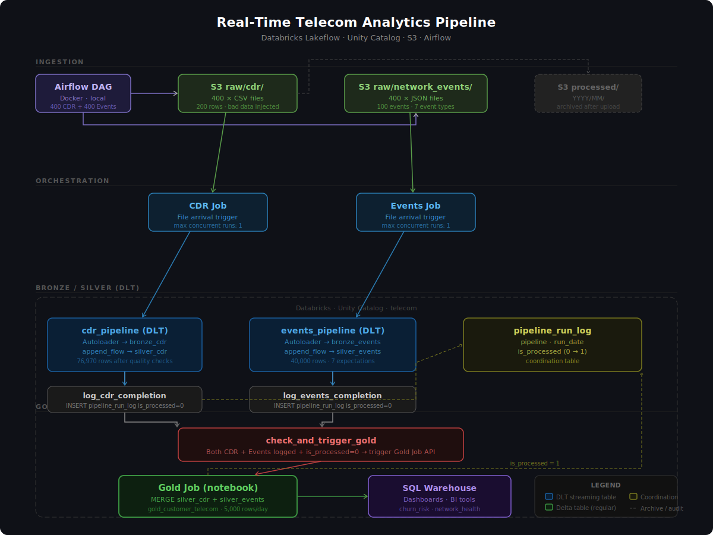

# Real-Time Telecom Analytics Pipeline

An end-to-end data engineering project built on Databricks, processing 120,000+ daily telecom records through a medallion architecture to deliver customer churn risk and network health analytics.



---

## Table of Contents

- [Overview](#overview)
- [Architecture](#architecture)
- [Tech Stack](#tech-stack)
- [Data Model](#data-model)
- [Pipeline Design](#pipeline-design)
- [Project Structure](#project-structure)
- [Setup & Running](#setup--running)
- [Key Design Decisions](#key-design-decisions)
- [Performance](#performance)
- [Resume Bullet Points](#resume-bullet-points)

---

## Overview

This project simulates a production-grade telecom data pipeline that processes Call Detail Records (CDR) and network events from 400 regional towers daily. The pipeline ingests raw files from S3, applies data quality checks, aggregates customer-level metrics, and surfaces churn risk scores and network health indicators through Databricks SQL Warehouse.

**Business use case:** Identify high-risk customers before churn occurs by combining call behavior (dropped calls, missed calls, international usage) with network quality signals (tower outages, poor signal, data throttling).

---

## Architecture

```
Airflow (Docker)
    ↓ uploads 800 files/day
S3 raw/cdr/          S3 raw/network_events/
    ↓ file arrival        ↓ file arrival
CDR Job               Events Job
    ↓                     ↓
cdr_pipeline (DLT)    events_pipeline (DLT)
bronze_cdr            bronze_network_events
silver_cdr            silver_network_events
    ↓                     ↓
log_cdr_completion    log_events_completion
    ↓                     ↓
check_and_trigger_gold (both done + is_processed=0)
    ↓
Gold Job → gold_notebook
    ↓ MERGE
gold_customer_telecom
    ↓
Databricks SQL Warehouse
```

### Medallion Architecture

| Layer | Tables | Purpose |
|---|---|---|
| Bronze | `bronze_cdr`, `bronze_network_events` | Raw ingestion via Autoloader — append only |
| Silver | `silver_cdr`, `silver_network_events` | Cleaned, validated, enriched records |
| Gold | `gold_customer_telecom` | Daily customer-level aggregations with churn metrics |

---

## Tech Stack

| Component | Technology |
|---|---|
| Data Platform | Databricks (Serverless) |
| Pipeline Framework | Lakeflow Spark Declarative Pipelines (DLT) |
| Storage Format | Delta Lake |
| Cloud Storage | AWS S3 |
| Catalog | Unity Catalog |
| Orchestration | Apache Airflow (Docker) |
| Ingestion Pattern | Autoloader + append_flow |
| Language | PySpark, Python, SQL |
| Infrastructure | AWS S3, Databricks Jobs API |

---

## Data Model

### Input Data

**CDR Files** (`raw/cdr/cdr_YYYYMMDD_NNN.csv`) — 400 files × 200 rows = 80,000 records/day
```
cdr_id, customer_id, call_date, call_time, call_duration_mins,
call_type, destination, charge, status, roaming
```

**Network Events** (`raw/network_events/events_YYYYMMDD_NNN.json`) — 400 files × 100 events = 40,000 records/day
```
event_id, customer_id, tower_id, timestamp, event_date,
event_type, signal_strength, data_speed_mbps, severity
```

**Bad data injected for realism:**
- 2% null durations
- 1% duplicate records
- 0.5% negative charges
- 0.3% future dates
- 1% invalid customer IDs

### Gold Table — `gold_customer_telecom`

| Column | Description |
|---|---|
| `snapshot_date` | Business date (partition key) |
| `customer_id` | Customer identifier |
| `total_calls` | Total calls made |
| `total_call_mins` | Total minutes |
| `total_charges` | Total revenue |
| `dropped_calls` | Number of dropped calls |
| `network_drops` | Network drop events |
| `tower_outages` | Tower outage events |
| `churn_risk_score` | `(drop_rate × 0.4) + (critical_events × 0.3) + (network_drops × 0.3)` |
| `churn_risk_label` | `high / medium / low` |
| `is_high_value` | 1 if total_charges ≥ $50 |
| `network_health_score` | `100 - (network_drops × 2) - (critical_events × 5)` |

### Coordination Table — `pipeline_run_log`

```
pipeline     STRING    -- 'cdr' or 'events'
run_date     DATE      -- business date
is_processed INT       -- 0 = logged, 1 = gold processed
logged_at    TIMESTAMP -- when pipeline completed
```

---

## Pipeline Design

### Decoupled CDR and Events Pipelines

CDR and Events pipelines run independently — whoever finishes last triggers the gold check. This avoids a single point of failure and allows different arrival times.

### Idempotency via MERGE

Gold uses Delta MERGE (not APPEND) — if gold runs multiple times for the same day, existing rows are updated rather than duplicated. This handles late-arriving data and pipeline retries cleanly.

### pipeline_run_log Coordination

```
CDR completes  → INSERT (cdr,   today, is_processed=0)
Events completes → INSERT (events, today, is_processed=0)
check_and_trigger_gold:
    Both logged AND is_processed=0 → trigger Gold Job API
Gold completes → UPDATE is_processed=1
Next run → is_processed=1 found → SKIP (no duplicate gold run)
```

### Data Quality — Silver Layer

**CDR expectations (10 rules):**
- `expect_or_drop`: valid cdr_id, customer_id, duration > 0, charge ≥ 0, no future dates, customer format CUST%
- `expect` (warn only): duration ≤ 600 mins, charge ≤ $1000, valid status, valid call type

**Events expectations (7 rules):**
- `expect_or_drop`: valid event_id, customer_id, tower_id, signal ≥ -120
- `expect` (warn only): data speed ≥ 0, valid severity, valid event type

---

## Project Structure

```
telecom-pipeline/
├── dags/
│   └── telecom_daily_upload_dag.py    # Airflow DAG — upload + verify + archive
├── pipelines/
│   ├── cdr_pipeline.py                # DLT pipeline — CDR bronze + silver
│   └── events_pipeline.py             # DLT pipeline — Events bronze + silver
├── notebooks/
│   ├── gold_notebook.py               # Gold aggregation + MERGE + S3 archive
│   ├── log_cdr_completion.py          # Logs CDR completion to pipeline_run_log
│   ├── log_events_completion.py       # Logs Events completion to pipeline_run_log
│   └── check_and_trigger_gold.py      # Checks both done → triggers Gold Job API
├── data_generation/
│   └── generate_test_data.py          # Generates synthetic CDR + events data
├── architecture.svg                   # Architecture diagram
└── README.md
```

---

## Setup & Running

### Prerequisites

- Databricks workspace (free trial works)
- AWS S3 bucket
- Docker Desktop (for Airflow)
- Python 3.9+

### 1. Generate test data

```bash
# Install dependencies
pip install pandas faker boto3

# Generate one day of data
python generate_test_data.py
# Output: output/raw/cdr/cdr_YYYYMMDD_001.csv ... 400.csv
#         output/raw/network_events/events_YYYYMMDD_001.json ... 400.json
```

### 2. Set up Databricks

```sql
-- Create Unity Catalog schemas
CREATE SCHEMA IF NOT EXISTS telecom.bronze;
CREATE SCHEMA IF NOT EXISTS telecom.silver;
CREATE SCHEMA IF NOT EXISTS telecom.gold;

-- Create Gold table (pre-create as regular Delta)
CREATE TABLE IF NOT EXISTS telecom.gold.gold_customer_telecom ( ... )
USING DELTA PARTITIONED BY (snapshot_date);

-- Create coordination table
CREATE TABLE IF NOT EXISTS telecom.bronze.pipeline_run_log (
    pipeline STRING, run_date DATE, is_processed INT, logged_at TIMESTAMP
) USING DELTA;
```

### 3. Create Lakeflow Pipelines

- Create `cdr_pipeline` → paste `pipelines/cdr_pipeline.py`
- Create `event_pipeline` → paste `pipelines/events_pipeline.py`

### 4. Create Databricks Jobs

**CDR Job:**
```
Task 1: cdr_pipeline        (DLT pipeline)
Task 2: log_cdr_completion  (notebook) — depends on Task 1
Task 3: check_and_trigger_gold (notebook) — depends on Task 2
Trigger: File arrival → s3://your-bucket/raw/cdr/
Max concurrent runs: 1
```

**Events Job:**
```
Task 1: events_pipeline        (DLT pipeline)
Task 2: log_events_completion  (notebook) — depends on Task 1
Task 3: check_and_trigger_gold (notebook) — depends on Task 2
Trigger: File arrival → s3://your-bucket/raw/network_events/
Max concurrent runs: 1
```

**Gold Job:**
```
Task 1: gold_notebook (notebook)
Trigger: API only (triggered by check_and_trigger_gold)
```

### 5. Start Airflow

```bash
cd airflow-telecom
docker-compose up -d

# Set Airflow Variables (Admin → Variables)
AWS_ACCESS_KEY = your_key
AWS_SECRET_KEY = your_secret
AWS_REGION     = us-east-1
S3_BUCKET      = your-bucket-name
LOCAL_DATA_DIR = /opt/airflow/data
```

### 6. Copy data and trigger

```bash
# Copy generated data to Airflow
cp output/raw/cdr/* airflow-telecom/data/raw/cdr/
cp output/raw/network_events/* airflow-telecom/data/raw/network_events/

# Trigger DAG manually in Airflow UI
# OR wait for 6 AM schedule
```

---


## Performance

| Stage | Duration |
|---|---|
| CDR pipeline (Bronze + Silver) | ~1 min 11s |
| Events pipeline (Bronze + Silver) | ~1 min 30s |
| log_cdr/events_completion | ~5s each |
| check_and_trigger_gold | ~10s |
| gold_notebook (MERGE + archive) | ~2 min |
| **Total end-to-end** | **~5 minutes** |

*Tested on Databricks Serverless compute with 80,000 CDR rows + 40,000 event rows.*
**Note:** Pipeline currently runs on Databricks Serverless compute which incurs a cold start. Actively exploring optimizations to reduce end-to-end latency. Target: under 2 minutes.

---

